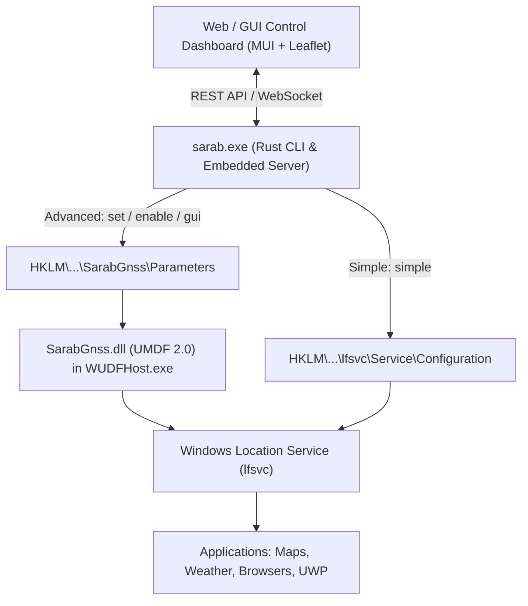

<div align="center">

# Sarab

**A Windows location provider that feeds custom coordinates into the native Windows Location platform.**

[](https://github.com/TheMRVX/sarab/actions/workflows/build.yml)
[](LICENSE)


-5C2D91)

[Overview](#overview) •
[Modes](#operating-modes) •
[GUI Dashboard](#web-control-dashboard--interactive-map-gui) •
[Installation](#installation) •
[Usage](#usage) •
[Building](#building-from-source) •
[Uninstall](#uninstallation) •
[FAQ](#faq)

</div>

---

## Overview

Sarab (Persian: *سراب*, "mirage") is a high-precision virtual GNSS driver and control suite that reports user-defined coordinates (latitude, longitude, altitude, accuracy) to Windows. Applications that use `Windows.Devices.Geolocation`, such as Windows Maps, Weather, Edge and Chrome, receive them as a fix from a real GPS sensor.

Typical use cases:

- Testing and debugging location-aware software without physical movement.
- QA of geo-dependent features (regional content, geofencing, weather).
- Research and development on the Windows Location stack.

> [!WARNING]
> Sarab is intended for development, testing and research on machines you own. You are responsible for complying with the terms of service of any application or service you use it with, and with applicable law.

## Operating Modes

| | **Advanced Mode** (recommended) | **Simple Mode** (fallback) |
|---|---|---|
| Mechanism | Virtual GNSS device (UMDF 2.0 driver) | Default-location registry values of `lfsvc` |
| Appears to Windows as | A physical GPS receiver | The system default location |
| Takes priority over Wi-Fi / IP location | Yes | No — used only when no other source is available |
| Requires driver | Yes | No |
| Requires Test Signing + Secure Boot off | Yes | No |
| Command | `sarab set` / `enable` / `gui` | `sarab simple` |

## Architecture



In short: `sarab.exe` writes the coordinates to the registry. In Advanced Mode the `SarabGnss` driver reads them and reports them to the Windows Location Service (`lfsvc`) as a GNSS sensor. In Simple Mode `lfsvc` reads the default-location values directly. Applications then query `lfsvc` as usual.

Repository layout:

```
sarab/
├── app/        Rust CLI: CLI parser, embedded HTTP server, driver IPC, installer, reader
├── driver/     C++ UMDF 2.0 virtual GNSS driver (SarabGnss)
├── gui/        Modern React 18 + Material-UI (MUI) + Leaflet interactive dashboard
├── scripts/    Release tooling
└── .github/    CI workflow (build, test-sign, package)
```

## Requirements

- Windows 10 (1809+) or Windows 11, 64-bit.
- Administrator privileges (PnP device installation and registry writes).
- **Advanced Mode only:**
  - Secure Boot disabled in UEFI/BIOS.
  - Test Signing enabled (`bcdedit /set testsigning on`), followed by a reboot.

## Installation

### 1. Download

Get the latest `sarab-vX.Y.Z-x64.zip` from [Releases](https://github.com/TheMRVX/sarab/releases) (or from the artifacts of a CI run) and extract it, for example to `C:\Sarab`.

### 2. Enable Test Signing (Advanced Mode, one-time)

Disable Secure Boot in firmware first, then in an elevated terminal:

```powershell
bcdedit /set testsigning on
shutdown /r /t 0
```

> [!CAUTION]
> **BitLocker:** changing boot configuration or Secure Boot state can make Windows ask for your 48-digit recovery key at the next boot. Make sure you have it ([account.microsoft.com/devices/recoverykey](https://account.microsoft.com/devices/recoverykey)), or suspend protection for one reboot:
>
> ```cmd
> manage-bde -protectors -disable C: -RebootCount 1
> ```

### 3. Allow Location Access

Open **Settings → Privacy & security → Location** and make sure both are on:

- **Location services**
- **Let desktop apps access your location**

### 4. Install the Driver

From an elevated prompt in the extracted folder:

```cmd
sarab.exe driver install
```

This imports the test certificate into the `Root` and `TrustedPublisher` stores, creates the `Root\SarabGnss` device node via SetupAPI, and installs and starts the driver. **Sarab Virtual GNSS** should now appear under *Sensors* in Device Manager. Use `--inf <path>` to point to a `SarabGnss.inf` outside the current directory.

Verify the installation right away:

```cmd
sarab.exe status
```

> Driver installation failing or the device showing an error (usually an unsigned-driver problem caused by inactive Test Signing)? See [Troubleshooting](#troubleshooting).

## Usage

```cmd
:: Set coordinates (example: Azadi Tower, Tehran)
sarab.exe set --lat 35.6997 --lon 51.3380 --alt 1200 --acc 5

:: Start providing the fix
sarab.exe enable

:: Check driver and service state
sarab.exe status

:: Read back what Windows actually reports
sarab.exe read
```

To confirm from an application, open Windows Maps or visit [BrowserLeaks Geolocation](https://browserleaks.com/geo) in Edge or Chrome.

### Web Control Dashboard & Interactive Map (GUI)

Launch the interactive dark-themed Material-UI dashboard:

```cmd
sarab.exe gui
```
*(or `sarab.exe web --port 8090`)*

Features:
- **Interactive Map:** Click anywhere or drag the target pin on high-detail CartoDB Dark Matter maps to spoof coordinates instantly.
- **Natural GPS Drift & Jitter:** 1Hz Gauss-Markov Ornstein-Uhlenbeck process mimics physical receiver tracking-loop errors, dynamic HDOP/VDOP jitter, and elevation-dependent SNR variations. Includes live 2D scatter radar in the dashboard.
- **Dynamic Route Simulator:** Define waypoints, select vehicle profiles (Walking 5 km/h, Cycling 20 km/h, Driving 60 km/h), and simulate realistic continuous motion with 1Hz live telemetry interpolation.
- **GNSS Constellation Telemetry:** Real-time satellite monitor with anti-spoofing stealth safeguards (elevation-dependent SNR spread between 28–44 dB-Hz avoiding intrusion detection).
- **Location Presets & Custom Bookmarks:** Instant teleportation to major cities (Tehran, Isfahan, Shiraz, Dubai, Tokyo, London, New York) or custom saved pins in `localStorage`.
- **System & Fix Verification:** Verify live fixes reported by `Windows.Devices.Geolocation` and audit Test Signing / BitLocker status in real time.

### Command Reference

| Command | Description |
|---|---|
| `gui` | Launch interactive Material-UI web control suite |
| `web` | Alias for `gui` (configurable via `-p, --port` and `-H, --host`) |
| `set` | Set spoof coordinates via CLI |
| `enable` | Start providing the spoofed fix |
| `disable` | Stop providing fixes |
| `status` | Show system state, driver status and active coordinates |
| `read` | Query live coordinates from `Windows.Devices.Geolocation` |
| `driver install [--inf <path>]` | Install the virtual GNSS driver |
| `driver uninstall` | Remove the device and driver package |
| `simple` | Configure Simple Mode (no driver) |

**`set` options**

| Option | Description | Default | Valid range |
|---|---|---|---|
| `--lat` | Latitude (decimal degrees) | required | −90 … 90 |
| `--lon` | Longitude (decimal degrees) | required | −180 … 180 |
| `--alt` | Altitude (meters) | `0.0` | — |
| `-c, --acc` | Horizontal accuracy (meters) | `5.0` | > 0 |
| `--drift` | Enable/disable natural Gauss-Markov GPS drift | `true` | flag (`--drift` / `--no-drift`) |
| `--drift-radius` | Mean-reverting 1σ wander radius (meters) | `1.2` | 0.0 … 50.0 |

> Run `sarab.exe <command> --help` for the authoritative option list of your build.

### Simple Mode

If you cannot enable Test Signing, set only the system default location:

```cmd
sarab.exe simple --lat 35.6997 --lon 51.3380
```

This writes `DefaultLatitude` / `DefaultLongitude` under `HKLM\System\CurrentControlSet\Services\lfsvc\Service\Configuration` and restarts `lfsvc`. Windows uses this only when no Wi-Fi, cellular or GPS source is available, so many applications will still show a different position.

### Configuration

The CLI stores its settings in `%APPDATA%\Sarab\config.toml`:

```toml
lat = 35.6997
lon = 51.3380
alt = 1200.0
acc = 5.0
enabled = true
```

## Building from Source

**Prerequisites**

- Rust toolchain (stable, MSVC target)
- Visual Studio 2022 with *Desktop development with C++*
- Windows Driver Kit (WDK) matching your Windows SDK

**CLI**

```cmd
cd app
cargo build --release
cargo test
```

**Driver**

Open `driver/SarabGnss.vcxproj` in Visual Studio (Release, x64) and build. The resulting package must be signed; for local use, a self-signed test certificate works with Test Signing enabled.

The [CI workflow](.github/workflows/build.yml) builds both components, generates a test certificate, signs the driver package and publishes the release archive.

## Uninstallation

Restore the system to its original state:

```cmd
sarab.exe disable
sarab.exe driver uninstall
bcdedit /set testsigning off
shutdown /r /t 0
```

Re-enable Secure Boot in firmware afterwards if you wish. If you used Simple Mode, remove the `DefaultLatitude` and `DefaultLongitude` values from the `lfsvc` registry key listed above.

## Troubleshooting

| Symptom | Likely cause / fix |
|---|---|
| `bcdedit` fails with a Secure Boot message | Disable Secure Boot in UEFI, then retry. |
| Driver installs but device shows an error | Test Signing is not active; verify with `bcdedit /enum` and reboot. |
| `sarab read` returns no position | Location services or desktop-app access is off; see [Allow Location Access](#3-allow-location-access). |
| Apps still show a different location | Browsers may cache or prefer Wi-Fi positioning; restart the app, or check `sarab status`. |
| Watermark "Test Mode" on desktop | Expected while Test Signing is on. |

## FAQ

**Does this work on Windows on ARM or 32-bit?** Not currently; only x64 is built.

**Does it affect other devices on my network or my IP address?** No. It only changes what the local Windows Location platform reports.

**Is it safe to leave Test Signing on?** It lowers a boot-time security guarantee. Turn it off when you no longer need the driver.

## Contributing

Issues and pull requests are welcome. Before submitting a change, please run `cargo fmt`, `cargo clippy` and `cargo test` in `app/`, and describe how you tested any driver changes.

## License

Released under the [MIT License](LICENSE).
